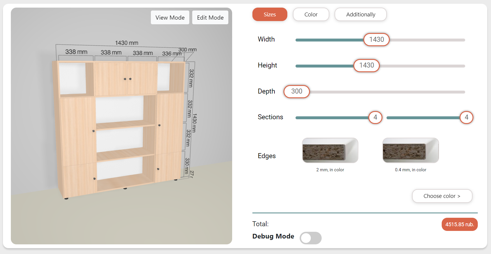
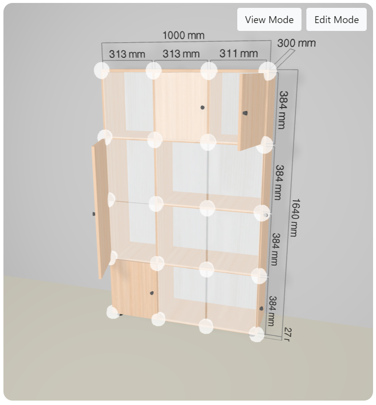

# Web furniture constructor
The Node.JS-based Furniture Web Builder is now completely open source. Further development and development is suspended and has not been conducted for a couple of years. PROTOTYPE.

## The penultimate version of the project with some bugs and shortcomings is stored here.

### Application launch npm run start
```sh
npm run start
```

The site will be available at localhost:3000

Login and password for accessing the site are stored in a file .env

### Assembling the style sheet and code
```sh
npm run build-webpack
npm run build-style
```

### Features

- Change basic dimensions
- Import/Export in JSON format
- View products in real time in 2D and 3D
- Adding, removing and editing various modifiers
- Cost calculation based on materials
- Interactive view of product and modifiers
- And other...

### Screenshots



### Author
Alexander Orlov, Perm State, RU

E-Mail: mister.qweeze@gmail.com or alexorlov.developer@gmail.com

Until the summer of 24, I serve in the army.

### License
MIT
